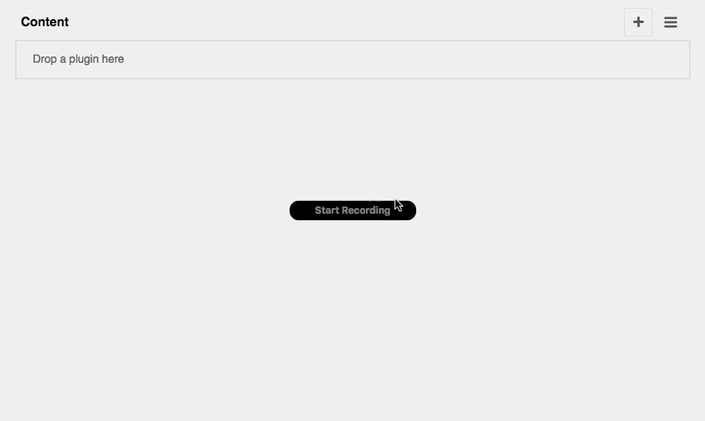

================
django CMS Video
================

|pypi| |build| |coverage|

**django CMS Video** is a set of plugins for `django CMS <http://django-cms.org>`_
that allow you to publish video content on your site (using an HTML5 player by default,
but you can override this in your own templates if required).

It uses files managed by `Django Filer <https://github.com/divio/django-filer>`_.

This addon is compatible with `Divio Cloud <http://divio.com>`_ and is also available on the
`django CMS Marketplace <https://marketplace.django-cms.org/en/addons/browse/djangocms-video/>`_
for easy installation.

Contributing
============

This is a an open-source project. We'll be delighted to receive your
feedback in the form of issues and pull requests. Before submitting your
pull request, please review our `contribution guidelines
<http://docs.django-cms.org/en/latest/contributing/index.html>`_.

One of the easiest contributions you can make is helping to translate this addon on
`Transifex <https://www.transifex.com/projects/p/djangocms-video/>`_.

Documentation
=============

See ``REQUIREMENTS`` in the `setup.py <https://github.com/divio/djangocms-video/blob/master/setup.py>`_
file for additional dependencies:

* Python 2.7, 3.3 or higher
* Django 1.8 or higher
* Django Filer 1.2.4 or higher

Make sure `django Filer <http://django-filer.readthedocs.io/en/latest/installation.html>`_
is installed and configured appropriately.

Installation
------------

For a manual install:

* run ``pip install djangocms-video``
* add ``djangocms_video`` to your ``INSTALLED_APPS``
* run ``python manage.py migrate djangocms_video``

Configuration
-------------

Note that the provided templates are very minimal by design. You are encouraged
to adapt and override them to your project's requirements.

This addon provides a ``default`` template for all instances. You can provide
additional template choices by adding a ``DJANGOCMS_VIDEO_TEMPLATES``
setting::

    DJANGOCMS_VIDEO_TEMPLATES = [
        ('feature', _('Featured Version')),
    ]

You'll need to create the `feature` folder inside ``templates/djangocms_video/``
otherwise you will get a *template does not exist* error. You can do this by
copying the ``default`` folder inside that directory and renaming it to
``feature``.

``MP4``, ``WEBM`` and ``OGV`` files are allowed by default. We recommend
adding all 3 source files for full browser compatibility. You can change
the default setting by overriding::

    DJANGOCMS_VIDEO_ALLOWED_EXTENSIONS = ['mp4', 'webm', 'ogv']

Running Tests
-------------

You can run tests by executing::

    virtualenv env
    source env/bin/activate
    pip install -r tests/requirements.txt
    python setup.py test

.. |pypi| image:: https://badge.fury.io/py/djangocms-video.svg
    :target: http://badge.fury.io/py/djangocms-video
.. |build| image:: https://travis-ci.org/divio/djangocms-video.svg?branch=master
    :target: https://travis-ci.org/divio/djangocms-video
.. |coverage| image:: https://codecov.io/gh/divio/djangocms-video/branch/master/graph/badge.svg
    :target: https://codecov.io/gh/divio/djangocms-video
